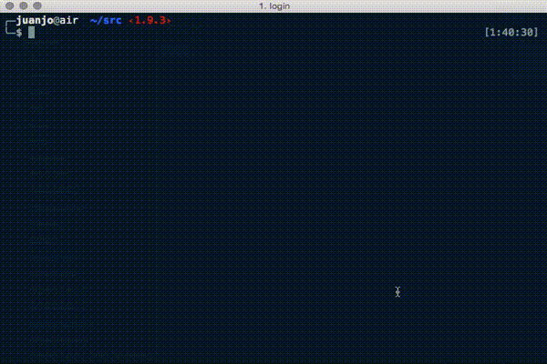

# Cliphar

[](https://travis-ci.org/jjtorroglosa/cliphar)
[](https://scrutinizer-ci.com/g/jjtorroglosa/cliphar/?branch=master)
[](https://scrutinizer-ci.com/g/jjtorroglosa/cliphar/?branch=master)

A zero-intrusive PHP microframework to instantly create command line apps.



## 1. Features

- Container Interop interfaces for IoC. Laravel's container implementation adapter provided.
- Logger implementation satisfying PSR-3 LoggerInterface
- ServiceProvider interface to register services into the application

## 2. Creating a cliphar application

The easiest way to create a new application is using composer create-project:

```bash
composer create-project cliphar/cliphar-skeleton cliphar-demo
cd cliphar-demo
php stub.php
```

### 2.1 Adding a command

Edit `resources/commands.php` and add there your awesome commands:

```php
<?php

use Symfony\Component\Console\Input\InputInterface;

cmd('awesome_command', '[option|o]="A default value" <argument>?',

    function (InputInterface $input, AnyService $anyService) {
        $anyService->anyFunction(
            $input->getOption('option'),
            $input->getArgument('argument')
        );
    }

);
```

And there you go. Enjoy:

    php stub.php awesome_command -o "your option" argument_passed

Notice that `InputInterface $input` is injected as well as `AnyService`. To be able to get `AnyService` injected it must be resolvable by the IoC container, i.e. either it's a class with resolvable dependencies or it is registered in a ServiceProvider.

### 2.2 Adding symfony commands

If you prefer to create Symfony commands by yourself instead of using the `cmd()` helper, you can register them in the class `Application` adding them to the array returned in `getCommands()` eithor by its FQCN or the instances directly. If you provide the FQCN, the framework will use the container to resolve the class. The same apply to the service providers.

### 2.3 Options and arguments definition syntax:

#### 2.3.1 Options
- Option represeting boolean value: `[option_name]`
- Shortcut: `[option_name|o]`. With this you can specify it as `php stub.php --option_name` , or `php stub.php -o`.
- Option with a default value: `[option_name]="default_value"`. If a default_value is specified you can't pass to your program that option without a value. So you can invoke your application as `php stub.php` or `php stub.php --option_name="a value"`. But this will throw error: `php stub.php --option_name`

#### 2.3.2 Arguments
- Required argument: `<argument>`.
- Optional argument: `<argument>?`.
- Optional argument with a default value: `<argument>="any default value"`.

## 3. Generating a phar

In the skeleton, there is a template box.json file which configures the compilation to a phar file. If you have [box2](https://github.com/box-project/box2) installed just do `box build` in the root directory of your application. Keep in mind that the option `phar.readonly` in your php.ini must be set to false.

For more info about box.json configuration and features see https://github.com/box-project/box2

## 4. Autowiring

The Laravel's container will autowire the dependencies declared in the constructor of your classes.

In the above example application, we are attaching The LoggerProvider ServiceProvider, which basically
binds the `Psr\Log\LoggerInterface` interface to a concrete implementation. So, in our
`Acme\Command\ExampleCommand`, if we declare a type hinted `Psr\Log\LoggerInterface $loggerInterface`
in its constructor we'll receive the registered implementation. That's it.

You can avoid creating a ServiceProvider to register ExampleCommand in the container. If that class exists,
and all its dependencies are resolvable by the container, we don't need to do further configuration,
Laravel Container will be able to create the object.

## 5. Registering new ServiceProviders

If you need custom injection, you can create a class implementing `Cliphar\ServiceProvider` interface and append it to the `getProviders()` function. In the constructor of the service provider you
can inject `Interop\Container\ContainerInterface` and `Cliphar\Binder` to bind your services.

## 6. More info

- [Symfony Console Documentation](http://symfony.com/doc/current/components/console/introduction.html)

## 7. Acknowledgements

- To Symfony for the Console component.
- To Laravel framework, for providing such a nice and powerful IoC container.
- To Cilex, for inspiring this project.
